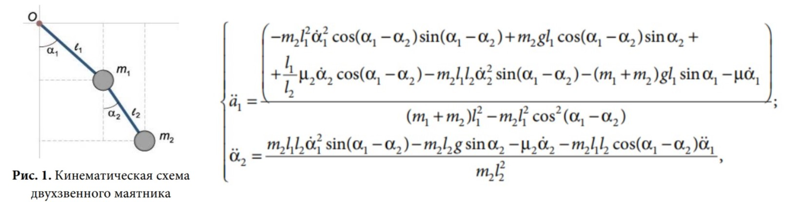
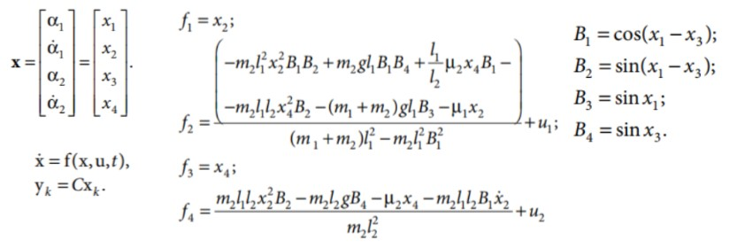

[TOC]

# 基于Matlab实现扩展卡尔曼滤波(EKF)

使用混合型扩展卡尔曼滤波器估计双摆模型在噪声干扰下的两个旋转角度(使用四阶龙格库塔法求解微分方程)。  

## 1. 状态空间方程

在现代控制中，使用状态空间方程描述系统  
$$\left\{\begin{matrix}
\dot{x}=f(x,u)\\
y = h(x,u)
\end{matrix}\right.$$  

由于实际物理模型运行时系统可能受到扰动，并且测量存在误差(干扰)，真实的状态空间方程为：  
$$\left\{\begin{matrix}
\dot{x}=f(x,u)+\omega\\
y = h(x,u)+\nu
\end{matrix}\right.$$  

$\omega, \nu$均为噪声且相互独立，$\omega \sim N(0, Q), \nu \sim N(0, R)$。  

我们无法对噪声进行准确建模，如果可以，那么将噪声作为已知项带入状态空间方程可以准确得到系统的状态。但是我们拥有噪声的统计学信息，卡尔曼滤波正是利用了这些信息，通过预测-校正两大步骤得到系统状态的**最优估计**。  
卡尔曼滤波器分为线性卡尔曼滤波器(KF)、扩展卡尔曼滤波器(EKF)、无迹卡尔曼滤波器(UKF)，后两种用于非线性系统的状态估计。  
根据状态方程和测量方程的形式分为标准型(两个方程均为连续或者离散形式)和混合型(一个为连续方程，另一个为离散方程)。

## 2. 线性卡尔曼滤波

### 2.1 标准型

#### 2.1.1 连续型

连续且含噪声的线性状态空间方程为：  
$$\left\{\begin{matrix}
\dot{x}(t)=A(t)x(t)+B(t)u(t)+\omega(t)\\
y(t) = C(t)x(t)+D(t)u(t)+\nu(t)
\end{matrix}\right.$$

初始值：$\hat{x}_{0}=E(x_{0})=m_{x_0},P_{0}=E[(x_0-m_{x_0})(x_0-m_{x_0})^T]=P_{x_0}$

$$z(t)=y(t)-C(t)\hat{x}(t)\\
K(t)=P(t)C^T(t)R^{-1}\\
\dot{\hat{x}}(t)=A(t)\hat{x}(t)+B(t)u(t)+K(t)z(t)\\
\dot{P}(t)=A(t)P(t)+P(t)A^T+Q(t)-K(t)R(t)K^T(t)
$$  
用龙格库塔法求解微分方程得$x(t)和P(t)$。

#### 2.1.2 离散型

离散化(前向欧拉或后向欧拉)得：  
$$\left\{\begin{matrix}
x_{k+1}=A_{k}x_{k}+B_{k}u_{k}+\omega_{k}\\
y_{k} = C_{k}x_{k}+D_{k}u_{k}+\nu_{k}
\end{matrix}\right.$$

初始值：$\hat{x}_{0}=E(x_{0})=m_{x_0},P_{0}=E[(x_0-m_{x_0})(x_0-m_{x_0})^T]=P_{x_0}$

* 预测(先验估计)：  
不考虑噪声，直接计算预测值$\hat{x}_{k|k-1}$，  
$$\hat{x}_{k|k-1}=A_{k}\hat{x}_{k-1|k-1}+B_{k}u_{k}
\\P_{k|k-1}=A_kP_{k-1|k-1}A_k^T+Q_k$$
$\omega_k \sim N(0, Q_k), \nu_k \sim N(0, R_k)$，$x_{k|k-1}$表利用k-1时刻的后验估计计算k时刻的先验估计，$x_{k|k}$表k时刻的后验估计，$x_{k-1|k-1}$表k-1时刻的后验估计。  

* 校正(后验估计)：  
利用测量值$y_k$进行修正，
$$z_k=y_k-C_k\hat{x}_{k|k-1}\\
S_k=C_kP_{k|k-1}C_k^T+R_k\\
卡尔曼增益：K_k=P_{k|k-1}C_k^TS_k^{-1}\\
修正：\hat{x}_{k|k}=\hat{x}_{k|k-1}+K_kz_k\\
更新：P_{k|k}=(I-K_kC_k)P_{k|k-1}(I-K_kC_k)^T+K_kR_kK_k^T$$

### 2.2 混合型

混合型状态空间方程为：  
$$\left\{\begin{matrix}
\dot{x}(t)=A(t)x(t)+B(t)u(t)+\omega(t)\\
y_k = C_kx_k+D_ku_k+\nu_k
\end{matrix}\right.$$  

* 预测(先验估计)：  
$$\dot{\hat{x}}(t)=A(t)\hat{x}(t)+B(t)u(t),\hat{x}_{(t_k-1)}=\hat{x}_{k-1|k-1}\\
\dot{P}(t)=A(t)P(t)+P(t)A^T+Q(t)-K(t)R(t)K^T(t), P_{(t_k-1)}=P_{k-1|k-1}$$  
求解微分方程得：  
$$\hat{x}_{k|k-1}=\hat{x}(t_k)\\
P_{k|k-1}=P(t_k)$$

* 校正(后验估计)：  
利用测量值$y_k$进行修正，
$$z_k=y_k-C_k\hat{x}_{k|k-1}\\
S_k=C_kP_{k|k-1}C_k^T+R_k\\
卡尔曼增益：K_k=P_{k|k-1}C_k^TS_k^{-1}\\
修正：\hat{x}_{k|k}=\hat{x}_{k|k-1}+K_kz_k\\
更新：P_{k|k}=(I-K_kC_k)P_{k|k-1}(I-K_kC_k)^T+K_kR_kK_k^T$$

## 3. 扩展卡尔曼滤波

用于处理非线性系统，  
$$\left\{\begin{matrix}
\dot{x}=f(x,u)\\
y = h(x,u)
\end{matrix}\right.$$  

本质思想是在每一点对系统进行线性化(泰勒公式)

### 3.1 标准型

#### 3.1.1 离散型

$$\left\{\begin{matrix}
x_{k+1}=f(x_k,u_k)+\omega_k\\
y_k = h(x_k)+\nu_k
\end{matrix}\right.$$  
输入信号一般不会与输出直接相关。  

* 预测(先验估计)：  
不考虑噪声，直接计算预测值$\hat{x}_{k|k-1}$，  
$$\hat{x}_{k|k-1}=f(\hat{x}_{k-1|k-1},u_k)\\
F_k = \frac{\partial f}{\partial x}|_{\hat{x}_{k-1|k-1},u_k},雅可比矩阵\\
P_{k|k-1}=F_kP_{k-1|k-1}F_k^T+Q_k$$

* 校正(后验估计)：  
利用测量值$y_k$进行修正，
$$z_k=y_k-h(x_{k|k-1})\\
H_k = \frac{\partial h}{\partial x}|_{\hat{x}_{k|k-1}},雅可比矩阵\\
S_k=H_kP_{k|k-1}H_k^T+R_k\\
卡尔曼增益：K_k=P_{k|k-1}H_k^TS_k^{-1}\\
修正：\hat{x}_{k|k}=\hat{x}_{k|k-1}+K_kz_k\\
更新：P_{k|k}=(I-K_kH_k)P_{k|k-1}(I-K_kH_k)^T+K_kR_kK_k^T$$

按定义，扩展卡尔曼滤波器得到的不是最优估计，因为对系统进行了近似线性化。

#### 3.1.2 连续型

$$F(t)=\frac{\partial f}{\partial x}|_{\hat{x}(t),u(t)}\\
H(t)=\frac{\partial h}{\partial x}|_{\hat{x}(t)}$$

### 3.2 混合型

$$F(t)=\frac{\partial f}{\partial x}|_{\hat{x}(t),u(t)}\\
H_k = \frac{\partial h}{\partial x}|_{\hat{x}_{k|k-1}}$$

## 4. 实验

### 4.1 被控系统

  
$\alpha$-杆相对竖直方向转过的角度，$\dot{\alpha}$-杆相对竖直方向转动的角加速度，这是一个非线性系统。  

取状态向量，得状态方程：  
  
属于混合型。

## 参考

1. [B站DR_CAN](https://www.bilibili.com/video/BV1ez4y1X7eR?spm_id_from=333.999.section.playall&vd_source=be5bd51fafff7d21180e251563899e5e)
